# William Frank's Portfolio - Action Plan

## Executive Summary

This action plan provides a step-by-step roadmap to build and deploy a professional data science portfolio following the zero-cost approach outlined in `portfolio-design-guide.md`. The plan prioritizes laptop development first, followed by Home Assistant Green deployment.

## Phase 1: Laptop Development Environment (Priority 1)

### 1.1 Initial Setup & Project Structure

- [x] Create project directory structure matching the guide
- [x] Initialize Git repository with proper .gitignore
- [x] Set up Node.js 18+ and Python 3.11+ environments
- [x] Install Docker Desktop for local containerization

**Status: COMPLETED** ✅

- Project structure: `/portfolio/{frontend,backend,data,docker,scripts}` directories created
- Git repository: Initialized with comprehensive .gitignore files
- Node.js: v22.17.0 (meets 18+ requirement)
- Python: v3.12.1 (meets 3.11+ requirement)
- Docker: v28.3.0 installed and running
- Backend: FastAPI setup with SQLAlchemy, Alembic migrations, and project CRUD endpoints

---

- Frontend: Next.js 15.4.5 with TypeScript, Tailwind CSS, and complete page structure
- Pages: Home, Projects, About, Contact, Research, Jupyter Notebook - all implemented with dark theme

### 1.2 Frontend Development Setup

- [x] Initialize Next.js 14 project with TypeScript and Tailwind CSS
- [x] Configure dark theme color palette from design guide
- [x] Set up project folder structure:
  ```
  portfolio/
   ├── frontend/
   │   ├── app/
   │   │   ├── page.tsx (Home)
   │   │   ├── projects/page.tsx
   │   │   ├── research/page.tsx
   │   │   ├── about/page.tsx
   │   │   ├── contact/page.tsx
   │   │   └── jupyter-notebook/page.tsx
   │   ├── components/
   │   ├── lib/
   │   ├── styles/
   │   └── public/
  ```

### 1.3 Backend Development Setup

- [x] Initialize FastAPI project structure
- [x] Set up SQLite database (zero-cost alternative to PostgreSQL)
- [x] Create basic API endpoints as defined in guide
- [x] Configure CORS and basic security

### 1.4 Core Components Development

- [x] Create reusable UI components (Button, Card, CodeBlock)
- [x] Implement layout components (Header, Navigation, Footer)
- [x] Build project showcase components (ProjectCard, ProjectGrid)
- [x] Create data visualization components

### 1.5 Content & Data Setup

- [x] Create sample project data following Project interface
- [x] Prepare 2-3 sample data science projects with descriptions
- [x] Set up basic project filtering by category
- [x] Create placeholder pages for all navigation items
- [x] Implement Jupyter Notebook viewer with proper styling

### 1.6 Local Testing & Optimization

- [x] Test frontend on localhost:3000
- [X] Test backend API on localhost:8000
- [X] Verify frontend-backend communication
- [x] Test responsive design on different screen sizes

## Phase 2: Data Integration & Backend Connection

### 2.1 Database Setup

- [X] Create sample data in SQLite database
- [X] Verify database schema matches frontend requirements
- [X] Test CRUD operations for projects

### 2.2 API Integration

- [ ] Connect frontend projects page to backend API
- [ ] Implement project details page with dynamic routing
- [ ] Add loading states and error handling
- [ ] Test API endpoints with sample data

### 2.3 Advanced Features

- [ ] Implement search functionality with backend support
- [ ] Add project filtering by category, status, and tags
- [ ] Create admin interface for managing projects
- [ ] Implement form validation and submission

## Phase 3: Home Assistant Green Preparation (Priority 2)

### 3.1 Hardware & Network Setup

- [X] SSH into Home Assistant Green: `ssh admin@homeassistant.local`
- [X] Verify Docker installation and ARM compatibility
- [X] Configure static IP address for consistent access
- [X] Set up DuckDNS dynamic DNS service

### 3.2 ARM-Optimized Build Configuration

- [X] Create ARM-compatible Dockerfiles
- [X] Configure Docker resource limits for 2GB RAM constraint
- [X] Set up SQLite database migration from development

### 3.3 SSL & Security Setup

- [ ] Install Let's Encrypt SSL certificates
- [ ] Configure Nginx reverse proxy with HTTPS
- [ ] Set up firewall rules for Home Assistant Green
- [ ] Configure CORS for production domain

### 3.4 Monitoring & Backup

- [ ] Deploy Uptime Kuma for monitoring
- [ ] Set up automated GitHub Actions for deployment
- [ ] Configure log rotation and cleanup
- [ ] Create USB backup script for Home Assistant Green

## Phase 4: Content & Final Testing

### 4.1 Project Content Creation

- [ ] Create 3-5 complete data science projects with:
  - Problem statements
  - Technical approaches
  - Interactive visualizations
  - Jupyter notebook integration
  - GitHub repository links

### 4.2 SEO & Analytics

- [ ] Configure Google Analytics 4
- [ ] Generate XML sitemap
- [ ] Set up Open Graph meta tags
- [ ] Test social media sharing

### 4.3 Final Testing

- [ ] Test complete user journey on laptop
- [ ] Deploy to Home Assistant Green
- [ ] Test external access via DuckDNS
- [ ] Verify SSL certificate validity
- [ ] Test backup and recovery procedures

## Immediate Next Steps (This Week)

### Day 1: Environment Setup

1. Install Node.js 18+, Python 3.11+, Docker Desktop
2. Create project directory structure
3. Initialize Git repository

### Day 2: Frontend Foundation

1. Create Next.js project with TypeScript and Tailwind
2. Implement dark theme from design guide
3. Create basic layout components

### Weekend: Core Functionality

1. Set up FastAPI backend with SQLite
2. Create sample projects with data
3. Test local deployment

## Zero-Cost Budget Confirmation

| Component            | Cost     | Status             |
| -------------------- | -------- | ------------------ |
| Home Assistant Green | $0       | Already owned      |
| Domain (DuckDNS)     | $0/year  | Ready to configure |
| SSL Certificate      | $0/year  | Let's Encrypt      |
| Hosting              | $0/month | Self-hosted        |
| Database             | $0       | SQLite             |
| Monitoring           | $0       | Uptime Kuma        |
| **Total**            | **$0**   | **Confirmed**      |

## Architecture Overview

```mermaid
graph TB
    subgraph "Development Phase"
        A[Laptop Development] --> B[Local Testing]
        B --> C[Docker Containerization]
    end

    subgraph "Deployment Phase"
        C --> D[Home Assistant Green]
        D --> E[ARM-Optimized Build]
        E --> F[SSL & Security]
        F --> G[Production Ready]
    end

    subgraph "Zero-Cost Stack"
        H[Next.js Frontend] --> I[FastAPI Backend]
        I --> J[SQLite Database]
        I --> K[Redis Cache]
        H --> L[Nginx Proxy]
        L --> M[Let's Encrypt SSL]
    end
```



## Emergency Backup Plan

If Home Assistant Green becomes unavailable:

1. **GitHub Pages**: Deploy static frontend
2. **Deta Space**: Deploy FastAPI backend
3. **Supabase**: Free PostgreSQL database
4. **Netlify**: Full-stack deployment with functions

---

**Next Action**: Complete backend API testing and implement frontend-backend communication for projects data.
