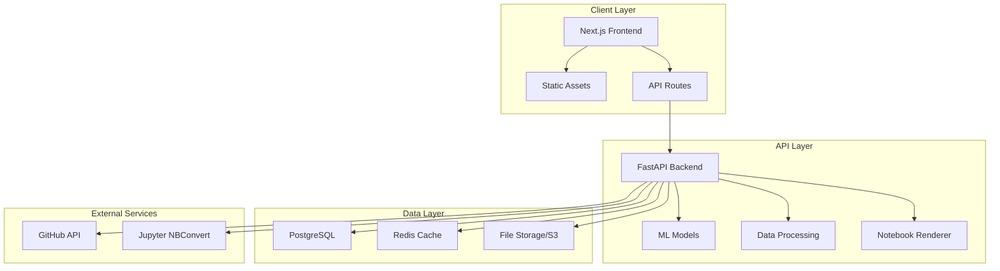

-------
# William Frank's Porfolio

## Executive Summary
-------
A professional, academic-style portfolio website designed to showcase expertise in Machine Learning - NLP - Data Science - Data Analysis. The site will feature interactive project demonstrations, Jupyter notebook integration, and a sophisticated dark-themed design optimized for technical content.

## System Architecture Overview

### Technology Stack
```
Frontend Framework: Next.js 14 (React 18)
Styling: Tailwind CSS + Framer Motion
Backend: FastAPI (Python)
Database: PostgreSQL + Redis (caching)
Deployment: Docker + Vercel (frontend) + Railway/Render (backend)
```

### Core Architecture Diagram


## Design System & Visual Guidelines

### Color Palette (Academic Dark Theme)
```css
/* Primary Colors */
--primary-dark: #0a0a0a        /* Background */
--primary-gray: #1a1a1a        /* Card backgrounds */
--secondary-gray: #2a2a2a      /* Borders */
--accent-gray: #3a3a3a         /* Hover states */

/* Text Colors */
--text-primary: #e0e0e0        /* Primary text */
--text-secondary: #b0b0b0      /* Secondary text */
--text-muted: #808080          /* Muted text */
--text-accent: #ffffff         /* Headers */

/* Accent Colors */
--accent-blue: #3b82f6         /* Primary accent */
--accent-purple: #8b5cf6       /* Secondary accent */
--accent-green: #10b981        /* Success states */
--accent-orange: #f59e0b       /* Warning states */
--accent-red: #ef4444          /* Error states */

/* Code Colors */
--code-bg: #0f172a             /* Code block background */
--code-border: #334155         /* Code block border */
```

### Typography Scale
```css
/* Font Family */
--font-sans: 'Inter', -apple-system, BlinkMacSystemFont, sans-serif
--font-mono: 'JetBrains Mono', 'Fira Code', monospace

/* Type Scale */
--text-xs: 0.75rem     /* 12px */
--text-sm: 0.875rem    /* 14px */
--text-base: 1rem      /* 16px */
--text-lg: 1.125rem    /* 18px */
--text-xl: 1.25rem     /* 20px */
--text-2xl: 1.5rem     /* 24px */
--text-3xl: 1.875rem   /* 30px */
--text-4xl: 2.25rem    /* 36px */
--text-5xl: 3rem       /* 48px */
```

### Spacing System
```css
--space-1: 0.25rem   /* 4px */
--space-2: 0.5rem    /* 8px */
--space-3: 0.75rem   /* 12px */
--space-4: 1rem      /* 16px */
--space-5: 1.25rem   /* 20px */
--space-6: 1.5rem    /* 24px */
--space-8: 2rem      /* 32px */
--space-10: 2.5rem   /* 40px */
--space-12: 3rem     /* 48px */
--space-16: 4rem     /* 64px */
--space-20: 5rem     /* 80px */
```

## Website Structure & Navigation

### Page Hierarchy
```
/
├── Home (/)
├── About (/about)
├── Projects (/projects)
│   ├── Project Categories
│   │   ├── Machine Learning
│   │   ├── NLP & RAG
│   │   ├── Data Visualization
│   │   └── Research
│   └── Individual Project Pages (/projects/[slug])
-------
├── Blog (/blog)
├── Contact (/contact)
└── Resume (/resume.pdf)
```

### Navigation Structure
```typescript
const navigation = [
  { name: 'Home', href: '/', icon: 'Home' },
  { name: 'About', href: '/about', icon: 'User' },
-------
  { name: 'Projects', href: '/projects', icon: 'Code' },
  { name: 'Blog', href: '/blog', icon: 'FileText' },
  { name: 'Contact', href: '/contact', icon: 'Mail' }
]
```

## Project Showcase Architecture

### Project Data Structure
```typescript
interface Project {
  id: string
-------
  slug: string
 title: string
 description: string
 category: 'ml' | 'nlp' | 'visualization'
 technologies: string[]
 thumbnail: string
  demoUrl?: string
  githubUrl: string
  notebookUrl?: string
  featured: boolean
  metrics?: {
    accuracy?: number
    f1Score?: number
    datasetSize?: number
  }
  content: {
    problem: string
    solution: string
    methodology: string[]
    results: string
    technicalDetails: string
  }
  visualizations: Visualization[]
}

interface Visualization {
  type: 'chart' | 'interactive' | 'notebook'
  title: string
  data: any
  config?: any
}
```

### Interactive Features
1. **Jupyter Notebook Renderer**: Convert .ipynb to interactive web format
2. **Live Model Demos**: Deployed ML models with API endpoints
3. **Interactive Charts**: D3.js/React-based visualizations
4. **Code Playground**: Executable Python code snippets
5. **Dataset Explorer**: Interactive data table with filtering

## Backend API Design

### FastAPI Endpoints
```python
# Project Management
GET    /api/projects                    # List all projects
GET    /api/projects/{id}              # Get specific project
GET    /api/projects/category/{cat}    # Filter by category
POST   /api/projects                   # Create new project (admin)

# Notebook Processing
POST   /api/notebooks/convert          # Convert .ipynb to web format
GET    /api/notebooks/{id}             # Get rendered notebook
POST   /api/notebooks/execute          # Execute notebook cells

# ML Model Endpoints
POST   /api/models/predict             # Make predictions
GET    /api/models/info                # Get model metadata
POST   /api/models/upload              # Upload new model (admin)

# Data Visualization
GET    /api/viz/data/{project_id}      # Get visualization data
POST   /api/viz/generate               # Generate new visualization

# Contact & Analytics
POST   /api/contact                    # Send contact email
GET    /api/analytics/views            # Get page view analytics
```

### Database Schema
```sql
-- Projects table
CREATE TABLE projects (
    id UUID PRIMARY KEY DEFAULT gen_random_uuid(),
    slug VARCHAR(255) UNIQUE NOT NULL,
    title VARCHAR(255) NOT NULL,
    description TEXT,
    category VARCHAR(50),
    technologies TEXT[],
    thumbnail_url VARCHAR(500),
    demo_url VARCHAR(500),
    github_url VARCHAR(500),
    notebook_url VARCHAR(500),
    featured BOOLEAN DEFAULT FALSE,
    metrics JSONB,
    content JSONB,
    created_at TIMESTAMP DEFAULT NOW(),
    updated_at TIMESTAMP DEFAULT NOW()
);

-- Blog posts
CREATE TABLE blog_posts (
    id UUID PRIMARY KEY DEFAULT gen_random_uuid(),
    slug VARCHAR(255) UNIQUE NOT NULL,
    title VARCHAR(255) NOT NULL,
    excerpt TEXT,
    content TEXT,
    tags TEXT[],
    published BOOLEAN DEFAULT FALSE,
    created_at TIMESTAMP DEFAULT NOW(),
    updated_at TIMESTAMP DEFAULT NOW()
);

-- Contact messages
CREATE TABLE contact_messages (
    id UUID PRIMARY KEY DEFAULT gen_random_uuid(),
    name VARCHAR(255) NOT NULL,
    email VARCHAR(255) NOT NULL,
    subject VARCHAR(255),
    message TEXT,
    created_at TIMESTAMP DEFAULT NOW()
);
```

## Component Architecture

### Reusable Components
```
components/
├── ui/
│   ├── Button.tsx
│   ├── Card.tsx
│   ├── Input.tsx
│   ├── Select.tsx
│   └── CodeBlock.tsx
├── layout/
│   ├── Header.tsx
│   ├── Footer.tsx
│   ├── Navigation.tsx
│   └── Layout.tsx
├── project/
│   ├── ProjectCard.tsx
│   ├── ProjectGrid.tsx
│   ├── ProjectDetail.tsx
│   ├── NotebookViewer.tsx
│   └── InteractiveChart.tsx
├── data-viz/
│   ├── ChartContainer.tsx
│   ├── ModelMetrics.tsx
│   └── DataTable.tsx
└── forms/
    ├── ContactForm.tsx
    └── NewsletterSignup.tsx
```

### Key Features Implementation

#### 1. Jupyter Notebook Integration
```typescript
// Notebook renderer component
const NotebookViewer = dynamic(
  () => import('@/components/project/NotebookViewer'),
  { ssr: false }
)

// Usage in project detail page
<NotebookViewer 
  notebookUrl={project.notebookUrl}
  enableInteraction={true}
  theme="dark"
/>
```

#### 2. Interactive Model Demo
```typescript
// Model prediction component
const ModelDemo = ({ modelId }: { modelId: string }) => {
  const [input, setInput] = useState('')
  const [prediction, setPrediction] = useState(null)
  const [loading, setLoading] = useState(false)

  const handlePredict = async () => {
    setLoading(true)
    const response = await fetch('/api/models/predict', {
      method: 'POST',
      body: JSON.stringify({ modelId, input })
    })
    const result = await response.json()
    setPrediction(result)
    setLoading(false)
  }

  return (
    <div className="model-demo">
      <textarea 
        value={input} 
        onChange={(e) => setInput(e.target.value)}
        placeholder="Enter input data..."
      />
      <button onClick={handlePredict} disabled={loading}>
        {loading ? 'Predicting...' : 'Run Model'}
      </button>
      {prediction && <PredictionResult data={prediction} />}
    </div>
  )
}
```

#### 3. Data Visualization Dashboard
```typescript
// Interactive chart component
const InteractiveChart = ({ 
  data, 
  chartType = 'line',
  interactive = true 
}) => {
  const [chartData, setChartData] = useState(data)
  
  return (
    <div className="chart-container">
      <ChartControls 
        onFilterChange={setChartData}
        availableFilters={data.filters}
      />
      <ResponsiveContainer width="100%" height={400}>
        {chartType === 'line' && (
          <LineChart data={chartData}>
            <CartesianGrid strokeDasharray="3 3" />
            <XAxis dataKey="x" />
            <YAxis />
            <Tooltip />
            <Line type="monotone" dataKey="y" stroke="#3b82f6" />
          </LineChart>
        )}
      </ResponsiveContainer>
    </div>
  )
}
```

## Development Workflow

### Project Structure
```
portfolio/
├── frontend/
│   ├── app/                    # Next.js app directory
│   ├── components/             # React components
│   ├── lib/                    # Utility functions
│   ├── styles/                 # Global styles
│   └── public/                 # Static assets
├── backend/
│   ├── app/
│   │   ├── api/               # API routes
│   │   ├── models/            # Pydantic models
│   │   ├── services/          # Business logic
│   │   └── utils/             # Helper functions
│   ├── notebooks/             # Jupyter notebooks
│   ├── models/                # ML model files
│   └── requirements.txt
├── docker/
│   ├── Dockerfile.frontend
│   ├── Dockerfile.backend
│   └── docker-compose.yml
└── scripts/
    ├── deploy.sh
    └── setup.sh
```

### Development Setup
```bash
# 1. Clone repository
git clone <repository-url>
cd portfolio

# 2. Backend setup
cd backend
python -m venv venv
source venv/bin/activate  # On Windows: venv\Scripts\activate
pip install -r requirements.txt
uvicorn app.main:app --reload --port 8000

# 3. Frontend setup
cd frontend
npm install
npm run dev

# 4. Database setup
docker-compose up -d postgres redis
alembic upgrade head

# 5. Environment variables
cp .env.example .env
# Edit .env with your configuration
```

## Free Deployment Strategy (Home Assistant Green + Free Services)

### Zero-Cost Deployment Architecture

#### Primary Hosting: Home Assistant Green
Your Home Assistant Green can serve as the primary host for both frontend and backend:

```yaml
# docker-compose.home-assistant.yml
version: '3.8'
services:
  portfolio-frontend:
    build:
      context: ./frontend
      dockerfile: Dockerfile
    ports:
      - "3000:3000"
    environment:
      - NEXT_PUBLIC_API_URL=http://homeassistant.local:8000
    restart: unless-stopped
  
  portfolio-backend:
    build:
      context: ./backend
      dockerfile: Dockerfile
    ports:
      - "8000:8000"
    environment:
      - DATABASE_URL=sqlite:///./portfolio.db
      - REDIS_ENABLED=false
    volumes:
      - ./data:/app/data
    restart: unless-stopped
  
  nginx:
    image: nginx:alpine
    ports:
      - "80:80"
      - "443:443"
    volumes:
      - ./nginx.conf:/etc/nginx/nginx.conf
      - ./ssl:/etc/nginx/ssl
    depends_on:
      - portfolio-frontend
      - portfolio-backend
    restart: unless-stopped
```

#### Free Cloud Alternatives (Backup/Redundancy)

**Frontend Options:**
- **GitHub Pages**: Free static hosting for Next.js static export
- **Vercel Free Tier**: 100GB bandwidth/month
- **Netlify Free**: 100GB bandwidth/month
- **Cloudflare Pages**: Unlimited bandwidth

**Backend Options:**
- **Deta Space**: Free Python app hosting (500MB storage)
- **Railway Free Tier**: $5 credit/month
- **Render Free**: 512MB RAM, sleeps after 15min inactivity
- **Fly.io Free**: 3 shared CPUs, 256MB RAM

**Database Options:**
- **SQLite**: File-based, perfect for Home Assistant Green
- **Deta Base**: Free NoSQL database
- **Supabase Free**: 500MB PostgreSQL
- **Neon Free**: 3GB PostgreSQL

### Home Assistant Green Setup Guide

#### 1. Install Docker on Home Assistant Green
```bash
# SSH into Home Assistant Green
ssh root@homeassistant.local

# Install Docker
curl -fsSL get.docker.com | sh
sudo usermod -aG docker $USER

# Install Docker Compose
sudo apt-get install docker-compose-plugin
```

#### 2. Configure Local Domain
```bash
# Edit hosts file for local development
sudo nano /etc/hosts
-------
-------
-------
# Add: 192.168.1.100 williamfranksportfolio.local
```

#### 3. SSL Certificate (Let's Encrypt)
```bash
# Install certbot for free SSL
-------
sudo apt-get install certbot
-------
-------
sudo certbot certonly --standalone -d williamfranksportfolio.local
```

#### 4. Optimized Docker Configuration
```dockerfile
# Dockerfile.frontend (optimized for ARM)
FROM node:18-alpine AS builder
WORKDIR /app
COPY package*.json ./
RUN npm ci --only=production
COPY . .
RUN npm run build

FROM node:18-alpine
WORKDIR /app
COPY --from=builder /app/.next ./.next
COPY --from=builder /app/public ./public
COPY --from=builder /app/package*.json ./
RUN npm ci --only=production
EXPOSE 3000
CMD ["npm", "start"]

# Dockerfile.backend (optimized for ARM)
FROM python:3.11-slim
WORKDIR /app
COPY requirements.txt .
RUN pip install --no-cache-dir -r requirements.txt
COPY . .
EXPOSE 8000
CMD ["uvicorn", "app.main:app", "--host", "0.0.0.0", "--port", "8000"]
```

### Free CI/CD Pipeline

#### GitHub Actions (Free)
```yaml
# .github/workflows/build-and-deploy.yml
name: Build and Deploy to Home Assistant Green
on:
  push:
    branches: [main]

jobs:
  build-and-deploy:
    runs-on: ubuntu-latest
    steps:
      - uses: actions/checkout@v3
      
      - name: Build frontend
        run: |
          cd frontend
          npm ci
          npm run build
          
      - name: Build backend
        run: |
          cd backend
          pip install -r requirements.txt
          
      - name: Deploy to Home Assistant Green
        run: |
          ssh root@homeassistant.local 'cd /opt/portfolio && git pull && docker-compose up -d --build'
```

### Zero-Cost Domain Options

-------
1. **Free Subdomains**:
-------
-------
   - williamfranksportfolio.duckdns.org
   - williamfrank.ddns.net
   - williamfrank.localhost.run

-------
2. **GitHub Pages Domain**:
-------
-------
   - williamfranksportfolio.github.io

3. **Local Network Access**:
   - http://homeassistant.local:3000
   - http://192.168.1.100:3000

### Performance Optimization for Home Assistant Green

#### Resource Constraints
- **CPU**: ARM Cortex-A53 quad-core 1.5GHz
- **RAM**: 2GB DDR4
- **Storage**: 32GB eMMC

#### Optimizations Applied
```yaml
# docker-compose.yml with resource limits
services:
  portfolio-frontend:
    deploy:
      resources:
        limits:
          memory: 512M
          cpus: '0.5'
  
  portfolio-backend:
    deploy:
      resources:
        limits:
          memory: 512M
          cpus: '0.5'
```

#### Static Site Generation
```json
// next.config.js for static export
module.exports = {
  output: 'export',
  trailingSlash: true,
  images: {
    unoptimized: true
  }
}
```

### Backup Strategy (Free)

1. **GitHub Repository**: All code and content
2. **GitHub Actions**: Automated SQLite backups
3. **Rclone**: Sync to Google Drive (15GB free)
4. **Local Backup**: USB drive connected to Home Assistant Green

### Monitoring (Free)

1. **Uptime Kuma**: Self-hosted monitoring
2. **Prometheus + Grafana**: Resource monitoring
3. **Logrotate**: Log management
4. **Healthchecks**: Simple health monitoring

### Complete Zero-Cost Stack

| Component | Free Option | Resource Usage |
|-----------|-------------|----------------|
| **Frontend** | Home Assistant Green + Nginx | 512MB RAM |
| **Backend** | FastAPI on Home Assistant Green | 512MB RAM |
| **Database** | SQLite (file-based) | 50MB storage |
| **Domain** | DuckDNS subdomain | Free |
| **SSL** | Let's Encrypt | Free |
| **CDN** | Cloudflare (optional) | Free |
| **Monitoring** | Uptime Kuma | 256MB RAM |
| **Total** | | ~1.5GB RAM, 1GB storage |

## Performance Optimization

### Frontend Optimizations
- **Static Generation**: Use Next.js SSG for project pages
- **Image Optimization**: Next.js Image component with blur placeholders
- **Code Splitting**: Dynamic imports for heavy components
- **Caching**: Service worker for offline functionality
- **CDN**: Cloudflare for static assets

### Backend Optimizations
- **Database Indexing**: Strategic indexes on frequently queried fields
- **Redis Caching**: Cache rendered notebooks and API responses
- **Rate Limiting**: Prevent API abuse
- **Compression**: Gzip compression for API responses
- **Pagination**: For large datasets

## Security Considerations

### Backend Security
- **Authentication**: JWT tokens for admin endpoints
- **Input Validation**: Pydantic models for request validation
- **CORS**: Configured for production domain
- **Rate Limiting**: IP-based rate limiting
- **SQL Injection**: SQLAlchemy ORM prevents injection

### Frontend Security
- **Content Security Policy**: Strict CSP headers
- **HTTPS**: Force HTTPS in production
- **XSS Protection**: React's built-in XSS protection
- **Form Validation**: Client and server-side validation

## Analytics & Monitoring

### Analytics Setup
- **Google Analytics 4**: User behavior tracking
- **Plausible Analytics**: Privacy-focused alternative
- **API Analytics**: Track endpoint usage
- **Error Tracking**: Sentry for error monitoring

### Performance Monitoring
- **Vercel Analytics**: Frontend performance
- **New Relic**: Backend performance monitoring
- **Database Monitoring**: Query performance analysis
- **Uptime Monitoring**: Health checks and alerts

## Content Management Strategy

### Project Documentation Template
```markdown
# Project Title

## Problem Statement
[Describe the problem you're solving]

## Solution Overview
[High-level solution description]

## Technical Approach
- **Algorithm**: [ML algorithm used]
- **Libraries**: [Key Python libraries]
- **Data**: [Dataset description and source]

## Results
- **Accuracy**: [Model performance metrics]
- **Impact**: [Business/research impact]

## Interactive Demo
[Link to live demo or embedded widget]

## Code Repository
[GitHub link with README]
```

## SEO & Marketing

### SEO Optimization
- **Structured Data**: JSON-LD for projects and articles
- **Meta Tags**: Dynamic meta tags for each page
- **Sitemap**: Automatic sitemap generation
- **Open Graph**: Social media preview cards
- **Schema.org**: Rich snippets for search results

### Content Strategy
- **Technical Blog**: Weekly posts about data science topics
- **Project Case Studies**: Detailed write-ups for each project
- **Research Papers**: Published work and collaborations
- **Tutorials**: Step-by-step guides for complex topics

## Maintenance & Updates

### Regular Tasks
- **Weekly**: Update project metrics and GitHub stats
- **Monthly**: Review and update dependencies
- **Quarterly**: Add new projects and refresh content
- **Annually**: Redesign and major updates

### Automation Scripts
```python
# scripts/update_projects.py
import requests
from github import Github

def update_github_stats():
    """Update project stars and forks from GitHub"""
    # Implementation for syncing GitHub data

def generate_sitemap():
    """Generate XML sitemap for SEO"""
    # Implementation for sitemap generation

def optimize_images():
    """Compress and optimize project images"""
    # Implementation for image optimization
```

## Zero-Cost Budget & Timeline

### Development Timeline (Extended for Free Setup)
- **Week 1**: Home Assistant Green setup and Docker installation
- **Week 2**: Basic Next.js structure and FastAPI backend
- **Week 3-4**: Project showcase with SQLite database
- **Week 5-6**: Jupyter notebook integration and static site generation
- **Week 7-8**: Performance optimization for ARM architecture
- **Week 9-10**: SSL setup, monitoring, and backup automation

### Zero-Cost Budget Breakdown
- **Home Assistant Green**: Already owned ($0)
- **Domain**: DuckDNS subdomain ($0/year)
- **SSL Certificate**: Let's Encrypt ($0/year)
- **Hosting**: Self-hosted on Home Assistant Green ($0/month)
- **Storage**: 32GB eMMC + external USB ($0)
- **Bandwidth**: Home internet connection ($0)
- **Monitoring**: Uptime Kuma self-hosted ($0)
- **Total**: $0/month, $0/year

### Home Assistant Green Setup Checklist

#### Hardware Requirements Met
- ✅ ARM Cortex-A53 quad-core 1.5GHz
- ✅ 2GB DDR4 RAM
- ✅ 32GB eMMC storage
- ✅ Gigabit Ethernet
- ✅ USB 3.0 ports for external storage

#### Software Stack Optimized
- ✅ ARM-compatible Docker images
- ✅ SQLite for lightweight database
- ✅ Static site generation for reduced server load
- ✅ Nginx reverse proxy for efficient routing
- ✅ Resource limits to prevent system overload

### Next Steps (Zero-Cost Implementation)

1. **Home Assistant Green Preparation**
   - SSH into device and install Docker
   - Configure static IP and local DNS
   - Set up DuckDNS for dynamic DNS

2. **Development Environment**
   - Clone repository to Home Assistant Green
   - Build ARM-optimized Docker images
   - Test local deployment at http://homeassistant.local:3000

3. **Content Creation**
   - Prepare project descriptions and notebooks
   - Optimize images for web delivery
   - Create static assets for fast loading

4. **Security & SSL**
   - Configure Let's Encrypt SSL certificates
   - Set up Nginx reverse proxy with HTTPS
   - Configure firewall rules

5. **Monitoring & Maintenance**
   - Deploy Uptime Kuma for monitoring
   - Set up automated backups to USB drive
   - Configure log rotation and cleanup

6. **Performance Tuning**
   - Optimize Docker resource limits
   - Enable gzip compression
   - Configure browser caching headers

### Emergency Backup Plan (Free Cloud Fallback)

If Home Assistant Green becomes unavailable:

1. **GitHub Pages**: Deploy static frontend
2. **Deta Space**: Deploy FastAPI backend
3. **Supabase**: Free PostgreSQL database
4. **Netlify**: Full-stack deployment with functions

### Complete Zero-Cost Architecture Summary

This portfolio will run entirely on your existing Home Assistant Green with:
- **Zero monthly costs**
- **Complete data ownership**
- **Local network access**
- **Internet accessibility via DuckDNS**
- **Professional SSL encryption**
- **Automated backups**
- **Performance monitoring**

-------
-------
The system is designed to be self-sufficient, secure, and professional-grade while leveraging only free services and your existing hardware investment.

This guide provides a complete roadmap for building a professional data science portfolio with zero ongoing costs, perfect for showcasing your expertise while maintaining complete control over your data and infrastructure.