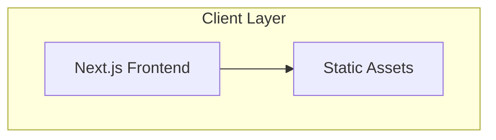

# William Frank's Portfolio

## Executive Summary

A professional, academic-style portfolio website designed to showcase expertise in Machine Learning, NLP, Data Science, and Data Analysis. The site will feature interactive project demonstrations, Jupyter notebook integration, and a sophisticated dark-themed design, all delivered as a static site.

## System Architecture Overview

### Technology Stack

```
Frontend Framework: Next.js 14 (React 18)
Styling: Tailwind CSS + Framer Motion
Deployment: GitHub Pages (static hosting)
```

### Core Architecture Diagram



## Design System & Visual Guidelines

### Color Palette (Academic Dark Theme)

```css
/* Primary Colors */
--primary-dark: #0a0a0a; /* Background */
--primary-gray: #1a1a1a; /* Card backgrounds */
--secondary-gray: #2a2a2a; /* Borders */
--accent-gray: #3a3a3a; /* Hover states */

/* Text Colors */
--text-primary: #e0e0e0; /* Primary text */
--text-secondary: #b0b0b0; /* Secondary text */
--text-muted: #808080; /* Muted text */
--text-accent: #ffffff; /* Headers */

/* Accent Colors */
--accent-blue: #3b82f6; /* Primary accent */
--accent-purple: #8b5cf6; /* Secondary accent */
--accent-green: #10b981; /* Success states */
--accent-orange: #f59e0b; /* Warning states */
--accent-red: #ef4444; /* Error states */

/* Code Colors */
--code-bg: #0f172a; /* Code block background */
--code-border: #334155; /* Code block border */
```

### Typography Scale

```css
/* Font Family */
--font-sans: "Inter", -apple-system, BlinkMacSystemFont, sans-serif;
--font-mono: "JetBrains Mono", "Fira Code", monospace;

/* Type Scale */
--text-xs: 0.75rem; /* 12px */
--text-sm: 0.875rem; /* 14px */
--text-base: 1rem; /* 16px */
--text-lg: 1.125rem; /* 18px */
--text-xl: 1.25rem; /* 20px */
--text-2xl: 1.5rem; /* 24px */
--text-3xl: 1.875rem; /* 30px */
--text-4xl: 2.25rem; /* 36px */
--text-5xl: 3rem; /* 48px */
```

### Spacing System

```css
--space-1: 0.25rem; /* 4px */
--space-2: 0.5rem; /* 8px */
--space-3: 0.75rem; /* 12px */
--space-4: 1rem; /* 16px */
--space-5: 1.25rem; /* 20px */
--space-6: 1.5rem; /* 24px */
--space-8: 2rem; /* 32px */
--space-10: 2.5rem; /* 40px */
--space-12: 3rem; /* 48px */
--space-16: 4rem; /* 64px */
--space-20: 5rem; /* 80px */
```

## Website Structure & Navigation

### Page Hierarchy

```
/
├── Home (/)
├── About (/about)
├── Projects (/projects)
│   ├── Project Categories
│   │   ├── Machine Learning
│   │   ├── NLP & RAG
│   │   ├── Data Visualization
│   │   └── Research
├── Blog (/blog)
├── Contact (/contact)
└── Resume (/resume.pdf)
```

### Navigation Structure

```typescript
const navigation = [
  { name: "Home", href: "/", icon: "Home" },
  { name: "About", href: "/about", icon: "User" },
  { name: "Projects", href: "/projects", icon: "Code" },
  { name: "Blog", href: "/blog", icon: "FileText" },
  { name: "Contact", href: "/contact", icon: "Mail" },
];
```

## Project Showcase Architecture

### Project Data Structure

```typescript
interface Project {
  id: string;
  slug: string;
  title: string;
  description: string;
  category: "ml" | "nlp" | "visualization";
  technologies: string[];
  thumbnail: string;
  demoUrl?: string;
  githubUrl: string;
  notebookUrl?: string;
  featured: boolean;
}
```

### Interactive Features

1.  **Jupyter Notebook Renderer**: Convert .ipynb to interactive web format.
2.  **Interactive Charts**: D3.js/React-based visualizations.

## Development Workflow

### Project Structure

```
portfolio/
├── frontend/
│   ├── app/                    # Next.js app directory
│   ├── components/             # React components
│   ├── lib/                    # Utility functions
│   ├── styles/                 # Global styles
│   └── public/                 # Static assets
```

### Development Setup

```bash
# 1. Clone repository
git clone <repository-url>
cd portfolio/frontend

# 2. Frontend setup
npm install
npm run dev
```

## Zero-Cost Deployment Strategy

### Free Cloud Hosting

- **GitHub Pages**: Free static hosting (recommended)
- **Netlify Free**: 100GB bandwidth/month
- **Cloudflare Pages**: Unlimited bandwidth

This guide provides a complete roadmap for building a professional data science portfolio with zero ongoing costs.
